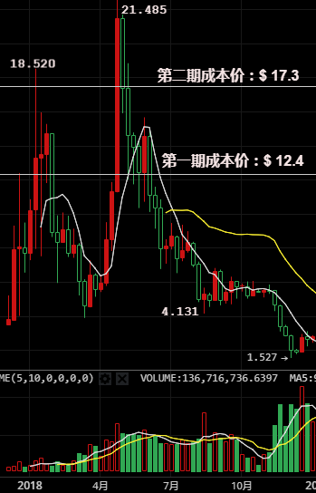
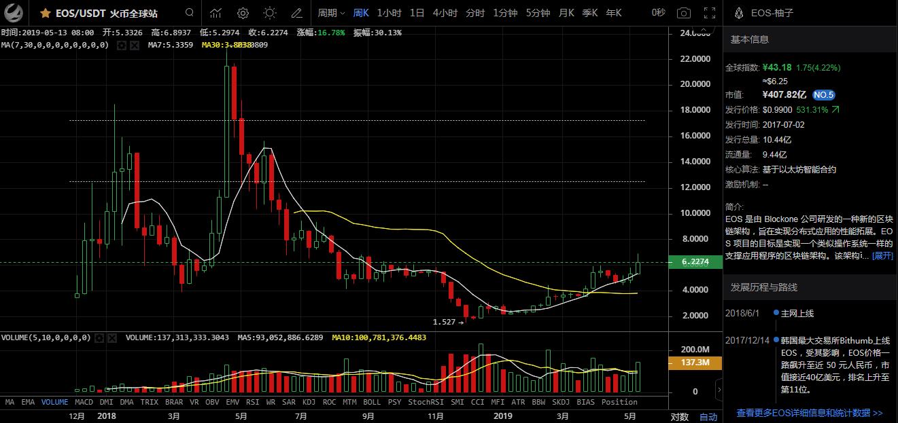

# 投资情况报告

007小王子

## 目录

* [A.投资说明](#投资说明)
    * [A.1.风险提示](#风险提示)
    * [A.2.投资规则](#投资规则)
    * [A.3.趋势判断](#趋势判断)
* [B.投资情况报告](#投资情况报告)
    * [B.01.2018年投资报告](#2018年投资报告)
    * [B.02.2019年5月投资报告](#2019年5月投资报告)
    * [B.02.2019年11月投资报告](#2019年11月投资报告)
* [C.持仓情况](#持仓情况)
    * [C.01.2018年末持仓明细](#2018年末持仓明细)
    
  
-----

## 投资说明
* 简书原文链接：[https://www.jianshu.com/p/d91c788a8d98](https://www.jianshu.com/p/d91c788a8d98)

> **注意：**请务必认真阅读以下条目，每一条都要只字不差地阅读，请务必认真揣摩字里行间的含义，必须在确信自己真的理解了之后，才可以接着阅读整个说明书。

### 风险提示

与任何项目一样，在起点上无法保证项目的最终成功……

**再次注意：**本项目有一定的失败风险，进而，本项目有归零的风险！请谨慎投资！三思！

虽然本项目有系统的投资策略及风险控制方案，整个区块链世界崩盘的概率也极低，但区块链资产短期价格变化非常大也是事实 —— 也就是说，没有耐心，等不及长期的投资者请千万不要参与。

在没有10倍收益之前，本项目不接受资金撤回 —— 希望自己能够快进快出的投资者请不要参与。

本项目开始之后，很可能并不会像很多人想象得那样很快会产生十数倍甚至数十倍的收益，一切希望一夜暴富的投资者请不要参与。

任何投资人都请注意：**千万不要过度投资！**可支配金额的 10% 以上已经会产生巨大的风险，请务必只投资自己可以丢掉的金额。 风险不仅是由概率决定的，更重要的是由下注比例决定，这一点请务必深入理解。（请认真阅读这篇文章： 《[别做“险盲”](http://zhibimo.com/read/xiaolai/reborn-every-7-years/B13.html)》)

在牛市里的坚定到了熊市就会烟消云散，早晚有一天你会见识到的：绝大多数人都是好龙的叶公而已 —— 如果不自信自己能够穿越一个以上的牛市熊市（[周期](http://zhibimo.com/read/xiaolai/reborn-every-7-years/B11.html)）， 就不要进来折腾了…… 会很严重地影响生活质量的。

熊市随时可能来临，不能抵御寒冬的人，还是不要参与了罢。

从来就很少有人喜欢说大实话：

> **“我做过的绝大多数事情都失败了。”**——孙正义

---

### 投资规则

* 1. **项目核心**：帮助投资人**买入并管理区块链资产**。
* 2. **项目周期**：7年 （第一期项目结束时间暂定为2024年11月1日）
* 3. **资金转入**：截止时间为 2017年12月29日18:00（星期五）
* 4. **收益分配**：
  * a. 如果在项目结束前，在收益达到10倍本金时，当月返还2倍本金（即本金1万返还2万。按照年化收益10%复利计算，7.2年本金翻倍）。剩余收益继续投资，在项目结束时按照1:9的比例分配（即投资人分配90%收益）。
  * b. 如果在项目结束时，收益超过2倍本金，但未达到10倍本金，小七收取5%的管理费。
  * c. 如果在项目结束时，收益未达到2倍本金，即为项目失败，按实际剩余资金全额返还给投资人，小七不收取管理费。
  * d. 收益分配时，现金或者数字货币转账，投资人可以任选一种。

* 5. **项目进展情况报告**：第1年(2018)，每月第一个星期日汇报项目收益情况；第2-7年(2019-2014)，每年5月和11月的最后一个星期日汇报项目收益情况。
* 6. 若小七因意外情况无法继续本项目，视为“项目结束”，由**贾琳**按照前款“收益分配计划”分配收益。

---

### 趋势判断

中国比特币首富李笑来，在2017年7月22日《人至践则无敌》线下大课上讲过一段话。

我只告诉你一件事：

> ###区块链真的是个大趋势。很可能是人类史上最大的趋势截至目前。

如果7年，5年前我还谨慎的说，那还是社会实验，2年前我说，早成功了，1年前，我早就玩命投了。

**在没有等到下一个牛市之前，你不算入行。不穿越一个牛熊周期，你就是打酱油的，没有穿过2个周期，别认为自己是专家，否则你就会做出傻X判断，穿过3个，说明你就是李笑来。**

-----

## 投资情况报告

-----

### 2018年投资报告

好久不见朋友们，你们还好吗？

现实很残酷，小七感谢你的信任。

信任特别宝贵，我很开心能够在生命里遇到你们，因为一起经历过痛苦的朋友更珍贵。

从目前的情况看，我们确实可以把所有的区块链资产**“当丢了”**，这说明：

>**我在2017年底的趋势判断，大概率是错误的;** n/ /n
**我在2018年的操作策略，大概率也是错误的;**

结果不会说谎，区块链投资的风险，确实远超预期。以下是2018年EOS/USDT价格走势图（数据来源：[火币全球站](https://www.aicoin.net.cn/chart/huobipro-eosusdt）：

#### 一、投资情况

截止2018年12月31日，【小七百万计划】第一年投资收益情况如下：
* 第一期账面亏损79%
* 第二期账面亏损90%
* 众筹CRE账面亏损98%

#### 二、下一步打算

持币不动——把所有的区块链资产**“当丢了”**。

#### 三、投资反思

这是一段痛苦的经历。

这次投资，让我对投资风险和市场周期有了更深刻的认识。

**周期是理财投资活动中最为关键的考量因素。**

可惜绝大多数人总是忽略周期。

**简单的说，一个上升趋势要加上一个下降趋势才构成一个完整的周期。**

李笑来说：
>**真正的趋势常常需要在多个周期（至少2个）之后才能真实展现。**——李笑来：[认识周期](https://link.jianshu.com/?t=http%3A%2F%2Fzhibimo.com%2Fread%2Fxiaolai%2Freborn-every-7-years%2FB11.html)

李笑来还说：
>**无论你买入了任何区块链资产，买了就当丢了，没有30倍的收益根本就不要去看。因为，从区块链的历史数据看，30倍是一个合理的预期收益。**

不去追涨杀跌是很难的。因为，绝大多数人，如果不经训练，是很难克服心中的恐惧的，这个恐惧体现两个方面：跌的时候，害怕继续跌所以卖掉；涨的时候，害怕不涨了，所以卖掉。

当然，也有惊喜，在资金管理上，我没有ALL IN，这是我目前还可以继续从容投资股市的坚实基础。

我相信：**这个世界稳赚不赔的投资，只有投资自已——做一个真正的终身学习者。**

谢谢！你若安好，便是晴天。

-----

### 2019年5月投资报告

以下是最新EOS/USDT价格走势图（数据来源：[火币全球站](https://www.aicoin.net.cn/chart/huobipro-eosusdt）：

#### 一、投资情况

截止2019年5月26日，投资收益情况如下：
* 第一期 账面亏损52%
* 第二期 账面亏损82%
* 众筹CRE 账面亏损96%

#### 二、下一步打算

持币不动——把所有的区块链资产**“当丢了”**。

#### 三、投资反思

这是一段痛苦的经历。

谢谢！你若安好，便是晴天。

-----

## 持仓情况

### 2018年末持仓明细

行情数据查询地址：[https://www.feixiaohao.com/](https://www.feixiaohao.com/)

#### 第一期持仓明细

编号|币种|数量|买入均价|持仓比例
:-:|:-:|:-:|:-:|:-:
1|ETH|8.53|￥5303|31.50%
2|EOS|894|￥85.54|63.78%
3|SHOW|20000|￥0.08|1.27%
4|PRS|1000|￥7.20|1.47%
5|IDT|10000|￥0.98|1.98%

#### 第二期持仓明细

编号|币种|数量|买入均价|持仓比例
:-:|:-:|:-:|:-:|:-:
1|ETH|1|￥10000|24.32%
2|EOS|95|￥120|44.62%
3|SHOW|20000|￥0.08|8.35%
4|PRS|1000|￥7.20|9.66%
5|IDT|10000|￥0.98|13.05%

#### 众筹CRE持仓明细

编号|币种|数量|买入均价|持仓比例
:-:|:-:|:-:|:-:|:-:
1|CRE|125000|￥0.48|100%

-----